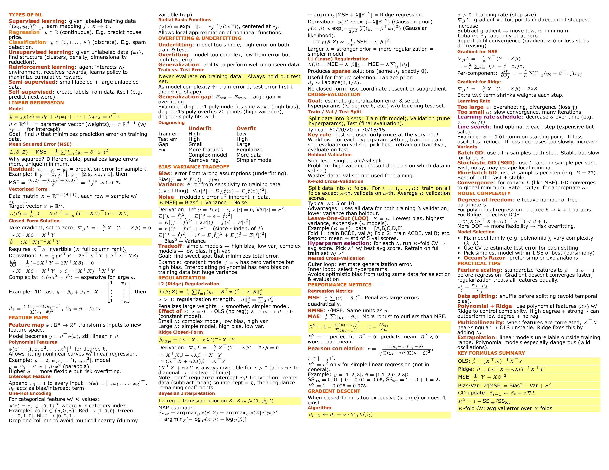
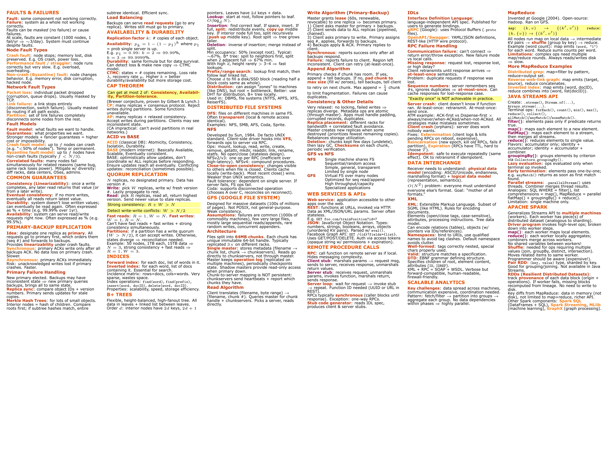
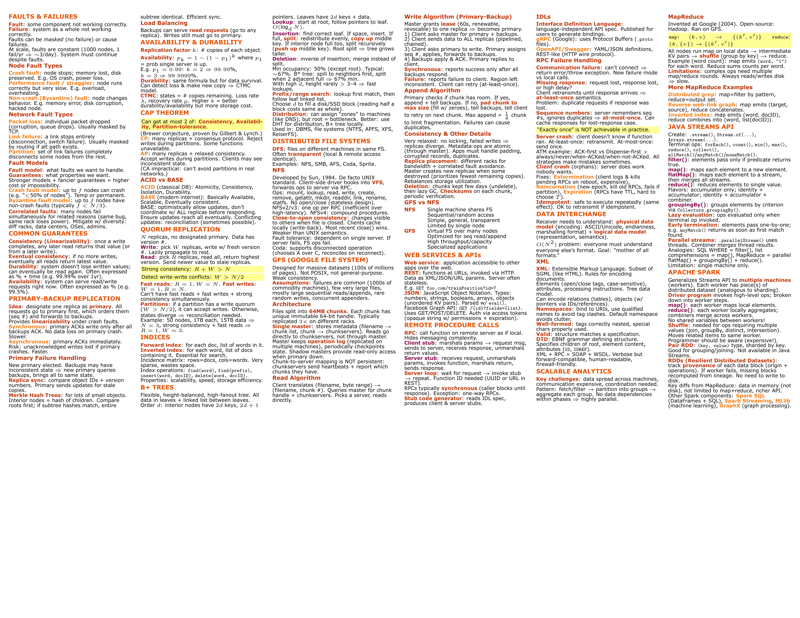

# 📄 Claude Cheatsheet Generator

> Turn your course slides and PDFs into **dense, exam-ready LaTeX cheatsheets** — powered by [Claude Code](https://docs.anthropic.com/en/docs/claude-code).

One command. Browser-based config. AI-generated LaTeX. Iterative editing loop. Done.

```
you: /cheatsheet-generator
      ↓
 ┌─────────────────────────────────────────────────────────┐
 │  Phase 1: Configure in browser                         │
 │  → paper size, columns, colors, font, file selection   │
 ├─────────────────────────────────────────────────────────┤
 │  Phase 2: Claude reads your materials & generates .tex  │
 │  → PDFs, PPTX, Markdown, images — all supported        │
 ├─────────────────────────────────────────────────────────┤
 │  Phase 3: Live editor in browser                        │
 │  → request changes in natural language, Claude edits    │
 └─────────────────────────────────────────────────────────┘
      ↓
 cheatsheet.tex — ready for Overleaf (XeLaTeX)
```

---

## 📸 Examples

Generated cheatsheets — compiled in Overleaf with XeLaTeX:







> Sample materials are available in [`skills/cheatsheet-generator/examples/sample_materials/`](skills/cheatsheet-generator/examples/sample_materials/) — try them yourself!

---

## ✨ Features

- **Multi-format input** — reads PDFs (with images/diagrams), PPTX (text + embedded media), Markdown, plain text, and images (PNG/JPG)
- **Browser-based configuration** — clean UI to set paper size, columns (2–6), font, margins, color scheme, detail level, and select which files to include
- **5 color schemes** — Classic, Ocean, Forest, Sunset, Mono — all designed for print readability
- **Extreme density** — fills every inch of the page with color-coded, abbreviated, formula-heavy content
- **Smart organization** — groups by topic hierarchy, not source file order; prioritizes exam-focus topics
- **Iterative editing** — browser-based editor where you describe changes in plain English (or attach images); Claude applies them live
- **Image-aware** — upload screenshots of formulas or diagrams during editing; Claude sees and incorporates them
- **XeLaTeX-ready** — output compiles directly in Overleaf with custom fonts

---

## 🚀 Quick Start

### Install

```bash
npx skills add https://github.com/Evan715823/cheatsheet-generator-skill
```

Then install Python dependencies:

```bash
pip install flask python-pptx pymupdf
```

### Use

1. `cd` into a folder containing your course materials (PDFs, slides, notes)
2. Run Claude Code and type:
   ```
   generate a cheatsheet for my exam based on the <your material files>
   ```
   Or use the slash command directly:
   ```
   /cheatsheet-generator
   ```
3. A browser window opens — configure your cheatsheet layout, select files, pick a color scheme
4. Claude reads all materials and generates `cheatsheet.tex`
5. Another browser window opens — request edits in natural language until you're happy
6. Upload `cheatsheet.tex` to [Overleaf](https://www.overleaf.com), compile with **XeLaTeX**

---

## 🎨 Color Schemes

| Classic | Ocean | Forest | Sunset | Mono |
|:---:|:---:|:---:|:---:|:---:|
| 🔵 Deep blue | 🌊 Royal blue | 🌲 Forest green | 🌅 Burnt orange | ⬛ Slate gray |
| Cyan / Purple | Teal / Indigo | Teal / Brown | Crimson / Magenta | Blue-gray tones |
| Green | Sea green | Olive | Amber | Cool gray |

All schemes include yellow highlight for critical formulas.

---

## ⚙️ Configuration Options

| Category | Options |
|---|---|
| **Paper** | Letter, A4, A3 |
| **Orientation** | Landscape, Portrait |
| **Columns** | 2 – 6 |
| **Font size** | 4 – 8 pt |
| **Font** | Verdana, Arial, Helvetica Neue, Times New Roman, Courier New, CMU Serif |
| **Margins** | 2 – 12 mm |
| **Detail level** | Concise (bullets only), Moderate (short explanations), Detailed (derivations + examples) |
| **Content toggles** | Include proofs, examples, derivations |
| **Exam focus** | Free-text field to prioritize specific topics |

---

## 📁 Project Structure

```
skills/cheatsheet-generator/
├── SKILL.md                    # Claude Code skill definition (orchestrator)
├── scripts/
│   ├── config_server.py        # Phase 1: browser config form server
│   └── editor_server.py        # Phase 3: iterative editing server
├── templates/
│   ├── cheatsheet_base.tex     # Parameterized LaTeX template
│   ├── config_form.html        # Configuration UI
│   └── editor_ui.html          # Editing/preview UI
└── examples/
    ├── sample_output.tex       # Reference cheatsheet (compilable)
    ├── sample_materials/       # Sample PDFs to try the skill
    └── screenshots/            # README images
```

---

## 🔧 How It Works

### Phase 1 — Configure

A local Flask server launches and opens a browser form. You configure layout (paper, columns, font, margins), content settings (detail level, proofs, examples), select a color scheme, and pick which files to include. Submitting writes `.cheatsheet_config.json` and the server exits.

### Phase 2 — Generate

Claude reads every selected file:
- **PDFs** — read directly (text + images via multimodal vision)
- **PPTX** — extracts text via `python-pptx` + all embedded images
- **Markdown/Text** — read directly
- **Images** — read directly (Claude is multimodal)

Then generates a complete `cheatsheet.tex` using the base template with your config values. Content is organized by topic, color-coded with semantic commands (`\concept{}`, `\process{}`, `\category{}`, `\important{}`), and packed to fill the entire page.

### Phase 3 — Edit

Another Flask server launches with a split-panel editor:
- **Left**: LaTeX source with syntax highlighting + optional PDF preview
- **Right**: natural language edit requests + image upload + change history

The server uses a blocking HTTP protocol — no polling, no file watching. When you submit a request, Claude reads the current `.tex`, applies your change, and posts the result back. Repeat until satisfied, then click **Done**.

---

## 💡 Tips

- **Compile with XeLaTeX** in Overleaf (not pdfLaTeX) — required for `fontspec` custom fonts
- **Exam focus** field is powerful — write "focus on: gradient descent, bias-variance tradeoff" and those topics get more space
- **Image upload in editor** — screenshot a formula from your textbook, paste/drag it into the editor, and ask Claude to add it
- **Multiple cheatsheets** — run the skill in different folders for different courses; each gets its own `cheatsheet.tex`
- Install `latexmk` and `pdftoppm` for live PDF preview in the editor (optional)

---

## 📋 Requirements

| Dependency | Required | Purpose |
|---|:---:|---|
| Claude Code | ✅ | AI engine |
| Python 3.8+ | ✅ | Server scripts |
| Flask | ✅ | Web servers |
| python-pptx | ⚠️ | PPTX reading (install if you have slides) |
| pymupdf | ⚠️ | PDF text extraction fallback |
| latexmk + pdftoppm | ❌ | Optional: live PDF preview in editor |

---

## 📄 License

MIT

---
